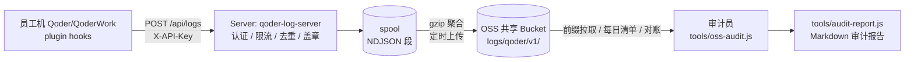

# qoder-request-logger

Qoder 使用审计日志集中收集系统：采集员工在 Qoder / QoderWork 中的 AI 使用行为（会话、提示词、工具调用、权限决策、credits 消耗），经内网服务端汇聚后归档到公司共享 OSS Bucket，供审计与治理分析。

> 内部审计工具，非通用中间件；涉及员工操作日志，仓库与 OSS 数据均按内部敏感数据管理。

## 架构与数据流



一条记录的旅程：插件 hook 捕获事件 → 本地 NDJSON 缓冲（按天分割）→ HTTP 上报 Server（共享 API Key 鉴权、限流、去重、按记录内 `email` 盖章归因）→ 落盘 spool → 定时 gzip 聚合上传 OSS（`logs/qoder/v1/date=.../user=.../src=.../part-*.jsonl.gz`）。

## 仓库结构

| 目录 | 内容 |
| --- | --- |
| `plugin/` | Qoder 插件「操作日志采集器」（hook 采集脚本、插件清单） |
| `server/` | Java 21 + Spring Boot 3.3 日志接收服务（qoder-log-server） |
| `tools/` | Key 生成、hooks 生成、端到端验证、OSS 审计 / 对账 / 报告脚本 |
| `docs/` | 运维手册、OSS 路径规范、容量规划 |
| `reports/` | 历史审计 / 验收报告快照（只读存档，不随迭代更新） |

## Server

### 构建

```bash
cd server
mvn -DskipTests package   # 产出 target/qoder-log-server-1.0.0.jar（需 JDK 21）
mvn test                  # 单元测试
```

### 本地运行（file 存储模式，全链路联调）

```bash
cd server
cp src/main/resources/api-keys.example.yml api-keys.yml   # 替换为真实 Key 注册表
mvn spring-boot:run -Dspring-boot.run.arguments="--oss.mode=file"
# 服务监听 :8080，归档对象落到 ./oss-storage/
```

生产部署（Docker Compose 或 jar + systemd）见 [docs/runbook.md](docs/runbook.md)。

### API

| 端点 | 说明 |
| --- | --- |
| `POST /api/logs` | 单条日志（NDJSON body） |
| `POST /api/logs/batch` | gzip 批量日志 |
| `GET /actuator/health` | 健康检查 |

- 所有 ingest 端点要求 `X-API-Key` 请求头；部署单条**全公司共享 Key**（仅接口鉴权，不参与归因——归因以记录内 `email` 为准），注册表 `api-keys.yml` 只存 SHA-256 哈希（用 `tools/gen-api-key.sh` 生成），文件 mtime 变化自动热加载。
- 防护默认值：限流 30 req/s/客户端 IP（429 + Retry-After）、body 上限 8MB（413）、spool 磁盘用量 ≥90% 返回 503（背压）、优雅停机 ≤120s。

## 插件

`plugin/` 是 Qoder 插件「操作日志采集器」（当前版本 1.1.0），通过 13 个 hook 事件覆盖会话生命周期、用户提示、agent 最终输出、工具调用与权限决策；凭据脱敏默认开启，可采集 transcript 中的 credits / tokens。

- **仅本地模式**：`QODER_LOG_SERVER_URL` 留空时只写本地 JSON Lines 日志（按天分割），不上报。
- **上报模式**：`QODER_LOG_UPLOAD_MODE=legacy`（逐条 push + outbox 重试，默认）或 `cursor`（offset 跟踪 gzip 批量上传）。
- **服务端异常不影响 Qoder 使用**（收集器视为可选增强，任何故障只降级采集、不阻塞 agent）：每次 push 带 socket 超时 + 硬超时（覆盖 DNS 解析与 TCP connect 阶段，默认 5s 档）；传输失败/超时/5xx/429 触发共享指数退避（`~/.qoder/logs/.request-logger/upload-state.json` 中 `consecutiveFailures`/`nextAttemptAtMs`，1min→2min→5min→15min→30min→1h 封顶），退避期间 hook 调用**零网络开销**（记录落 outbox / 本地日文件，恢复后自动补传，服务端去重）；Key 被拒（401/403）仍走既有 24h 熔断。单次 2xx 即清除退避自动恢复。
- **统一分发模式（推荐）**：`gen-hooks.py --server-url ... --api-key qk_<共享Key>` 把 Server 地址与全公司共享 Key 直接写进统一包，一个包全员安装；归因不依赖 Key（以记录内 `email` 为准）。本机凭据文件 `~/.qoder/log-credentials.json`（`QODER_LOG_CREDENTIALS_FILE` 可覆盖路径）仅作为单机覆盖的可选兜底（见 runbook §4.5）。

关键环境变量（配置于 `plugin/hooks/hooks.json` 各事件的 `env` 块）：

| 变量 | 说明 |
| --- | --- |
| `QODER_LOG_SERVER_URL` | Server 地址；留空 = 仅本地日志 |
| `QODER_LOG_API_KEY` | 上报鉴权 API Key（`qk_` 前缀，统一分发包内置全公司共享 Key）；留空时回退读取凭据文件 |
| `QODER_LOG_USER_ID` | 企业身份覆盖：作为记录 `email`（Server 归因用）与 `client_id`；统一分发包留空，由 QoderWork payload / git 配置提供；留空时同上回退 |
| `QODER_LOG_CREDENTIALS_FILE` | 本机凭据文件路径（默认 `~/.qoder/log-credentials.json`，格式 `{api_key, user_id}`；仅单机覆盖场景使用，统一包无需下发） |
| `QODER_LOG_UPLOAD_MODE` | `legacy` \| `cursor` |
| `QODER_LOG_UPLOAD_INTERVAL_SEC` | 上报间隔（秒，cursor 两次上传尝试的最小间隔） |
| `QODER_LOG_BATCH_MAX_LINES` | cursor 单批最大行数（默认 `2000`） |
| `QODER_LOG_BATCH_MAX_MB` | cursor 单批最大体积（压缩前明文 MB，默认 `6`；须低于服务端 `audit.max-body-mb=8`） |
| `QODER_LOG_REDACT` | `1` 开启凭据脱敏 |
| `QODER_LOG_LOCAL_RETENTION_DAYS` | 本地日志保留天数（`0` = 不清理） |

`hooks.json` 由 `tools/gen-hooks.py` 生成；分发产物为根目录 zip（构建产物，不入库）。

## 验证

```bash
tools/verify-collector.sh      # 插件端 E2E：hook 触发 → 本地日志 → 上报
tools/verify-e2e-server.sh     # 服务端 E2E：ingest → spool → file 模式归档
node tools/mock-log-server.js  # 本地 mock Server（插件联调用）
```

## 文档索引

| 文档 | 内容 |
| --- | --- |
| [docs/runbook.md](docs/runbook.md) | 部署运维手册：OSS 基座检查单、RAM 最小权限策略、Server 部署、共享 Key 管理 |
| [docs/oss-path-spec.md](docs/oss-path-spec.md) | OSS 对象键三方契约（Server / 审计工具 / 插件），破坏性变更须升版 `v2/` |
| [docs/capacity-planning.md](docs/capacity-planning.md) | 容量与成本论证 |

## 版本与发布约定

单仓库承载两个独立交付物，各自打 tag 发版：

- **插件**：`plugin-vX.Y.Z`，版本号同步 `plugin/.qoder-plugin/plugin.json`，分发包 zip 不入库。
- **服务端**：`server-vX.Y.Z`，版本号同步 `server/pom.xml` 与 Docker image tag（`sigmob/qoder-log-server:X.Y.Z`）。

## 安全红线

- `server/.env`（OSS AK/SK）与真实 Key 注册表**绝不入库**，已由 `.gitignore` 兜底。
- Server 只存 Key 的 SHA-256 哈希，明文共享 Key 仅在生成/打包瞬间存在于安全渠道；OSS AK/SK 仅经环境变量注入。
- OSS 写权限 RAM 策略硬编码 `logs/qoder/*` 前缀（见 runbook §1.2），AK 泄露也无法触达其他业务前缀。
