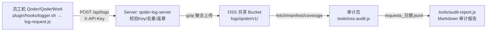

# Runbook —— Qoder 使用审计日志集中收集系统运维手册

| 项目 | 内容 |
| --- | --- |
| 文档版本 | v1.0 |
| 适用范围 | 平台运维（OSS/Server）、IT 分发（客户端配置）、审计员（只读） |
| 关联文档 | `docs/oss-path-spec.md`（路径契约）、`docs/capacity-planning.md`（容量论证） |
| 系统组成 | 员工端插件 hook（`plugin/hooks/log-request.js`）→ 内网 Java Spring Boot Server（`server/`）→ 阿里云 OSS 共享 Bucket → 审计工具（`tools/oss-audit.js` + `tools/audit-report.js`） |



---

## 1. OSS 基座检查单（T2，纯控制台操作）

> 全部操作在阿里云 OSS 控制台 + RAM 控制台完成，无需任何代码。逐项打勾后方可进入 Server 部署。

| # | 检查项 | 操作 | 完成 |
| --- | --- | --- | --- |
| 1 | 申请业务前缀 | 在公司共享日志 Bucket 内向 Bucket Owner（平台团队）申请 `logs/qoder/` 业务前缀，登记业务名、负责人、预估量级 | ☐ |
| 2 | 服务端加密 | Bucket 概览 → 数据加密：开启 **SSE-KMS**，选择本项目**专属 CMK**（不要用 `alias/acs/oss/default`，便于按业务轮转密钥） | ☐ |
| 3 | 拒绝匿名 | 权限管理 → Bucket 授权策略中确认无 `*` 主体授权；读写均须 RAM 子账号（本节第 6 步的两个账号） | ☐ |
| 4 | 访问日志投递 | 日志管理 → 开启**访问日志**，投递到 `logs/oss-access/` 前缀（与业务前缀隔离），用于泄露检测与故障排查 | ☐ |
| 5 | 生命周期规则 | 基础设置 → 生命周期 → 新建规则（按前缀匹配，见下表） | ☐ |
| 6 | RAM 最小权限账号 | 创建两个子账号并绑定策略 JSON（见 §1.2 / §1.3） | ☐ |

### 1.1 生命周期规则

| 规则名 | 前缀 | 动作 | 依据 |
| --- | --- | --- | --- |
| qoder-audit-ia | `logs/qoder/v1/` | 创建 **180 天**后转低频存储（IA） | 180 天后审计访问频率显著下降 |
| qoder-audit-delete | `logs/qoder/v1/` | 创建 **365 天**后删除 | 审计合规保留期；如有合规要求延长，仅调整此值（路径与权限零改动） |

> `_manifest/`（位于 `logs/qoder/v1/_manifest/`）随同前缀规则生效，无需单独配置。

### 1.2 Server 写账号 RAM 策略（完整 JSON）

账号：`qoder-log-writer`（仅 Server 使用，AK 由 `OSS_AK_ID`/`OSS_AK_SECRET` 环境变量注入，见 §3.3；若走 ECS 实例 RAM 角色的免 AK/SK 模式，则把同一策略 JSON 绑定到实例角色而非子账号，见 §3.3 的 `instance-profile`）。

```json
{
  "Version": "1",
  "Statement": [
    {
      "Effect": "Allow",
      "Action": [
        "oss:PutObject",
        "oss:ListObjects",
        "oss:AbortMultipartUpload"
      ],
      "Resource": [
        "acs:oss:*:*:<公司共享日志Bucket>/logs/qoder/*"
      ]
    },
    {
      "Effect": "Allow",
      "Action": [
        "kms:Encrypt",
        "kms:GenerateDataKey"
      ],
      "Resource": [
        "acs:kms:*:*:key/<专属CMK的key-id>"
      ]
    }
  ]
}
```

要点：**只有** `PutObject`（写 part/manifest）、`ListObjects`（对账列举）、`AbortMultipartUpload`（清理失败分片）；Resource 硬编码业务前缀 `logs/qoder/*`——即便 AK 泄露也无法读写其他业务前缀；KMS 权限仅为 SSE-KMS 加密所需，限定到专属 CMK。

### 1.3 审计只读账号 RAM 策略（完整 JSON）

账号：`qoder-log-auditor`（发放给审计员机器配置 ossutil / 供 `tools/oss-audit.js` 使用）。

```json
{
  "Version": "1",
  "Statement": [
    {
      "Effect": "Allow",
      "Action": [
        "oss:GetObject",
        "oss:ListObjects"
      ],
      "Resource": [
        "acs:oss:*:*:<公司共享日志Bucket>/logs/qoder/*"
      ]
    }
  ]
}
```

要点：只读、同前缀限定；无 KMS 权限（解密由 OSS 服务端透明完成，GetObject 即返回明文）。

### 1.4 基座验收

```bash
# 用 writer 账号验证可写（应成功）
ossutil cp /tmp/probe.txt oss://<bucket>/logs/qoder/v1/_manifest/probe.txt
# 用 writer 账号验证越界写（应 403）
ossutil cp /tmp/probe.txt oss://<bucket>/logs/other-business/probe.txt
# 用 auditor 账号验证可读（应成功）
ossutil cp oss://<bucket>/logs/qoder/v1/_manifest/probe.txt /tmp/probe-back.txt
# 用 auditor 账号验证不可写（应 403）
ossutil cp /tmp/probe.txt oss://<bucket>/logs/qoder/v1/_manifest/probe2.txt
# 清理探针
ossutil rm oss://<bucket>/logs/qoder/v1/_manifest/probe.txt
```

---

## 2. 前置条件与已知限制（先读！）

| # | 条件/限制 | 说明 | 后果与对策 |
| --- | --- | --- | --- |
| 1 | **内网 HTTPS 与 CA 证书** | Server 若部署为内网 HTTPS（自签/企业 CA），Node 默认不信任企业根 CA | **必须**将企业 CA 证书随插件分发落到固定路径（如 `~/.qoder/plugins/ca/sigmob-root.crt`），并在 `hooks.json` 环境（或系统级）设置 `NODE_EXTRA_CA_CERTS=~/.qoder/plugins/ca/sigmob-root.crt`。**否则 Node 证书校验失败，上报全部静默进 outbox 死循环**（客户端 hook 永远 exit 0，不报错），G1 首日专项检查必须核对 Server 接收量 |
| 2 | 无 Node 机器 | `logger.sh` 找不到 Node 时自动回退 jq 兜底采集器（`plugin/hooks/log-request.sh`） | 兜底采集器**仅本地落盘，无上报能力**（无 `/api/logs` 通道）。此类机器需先安装 Node ≥ 16 或长期接受本地采集；coverage 报告会将其识别为"未上报" |
| 3 | 客户端本地始终双写 | 本地 `$QODER_LOG_DIR/requests_<D>.jsonl`（默认 `~/.qoder/logs`）**永远开启**，HTTP 上报是增量能力（`QODER_LOG_SERVER_URL` 非空才启用） | 天然回滚路径（见下）与对账数据源 |
| 4 | 回滚方案 | 清空 `hooks.json` 各事件 `env` 中的 `QODER_LOG_SERVER_URL`（置 `""`），插件回到纯本地现状 | 零代码回滚。注意：Server 停机期间客户端**本地继续落盘、上报失败进 outbox**（`~/.qoder/logs/.request-logger/outbox.ndjson`，上限 8MB），游标停滞；恢复后下一次 hook 调用自动 drain 追平，无需人工干预 |
| 5 | outbox 有界 | 客户端 outbox 上限 8MB（硬编码常量 `outboxMaxBytes`，见 `plugin/hooks/log-request.js` CONFIG），超限后新失败记录被丢弃 | 长时间断连场景以 Server spool + OSS 已传数据为准；对账用 `oss-reconcile.js` |
| 6 | 记录自报身份不可信 | 归因以 Server 端 API Key 注册表为准（`ingest_user` 盖章），记录内拍平的 `email` 字段仅交叉校验（不一致计入 identityMismatch 指标） | 见 `docs/oss-path-spec.md` §5 |
| 7 | **工作区代码合并 ≠ 生产生效** | 生产 hook 由 `~/.qoder/plugins` 缓存内的**已安装插件副本**执行，本仓库工作区的改动不会自动到达客户端 | 重新安装/发布插件后才生效；装后用 `grep -m1 '"email"' ~/.qoder/logs/requests_*.jsonl` 确认新采集器已在运行（1.1.0 = 企业身份拍平到最外层、无企业身份不采集的版本） |
| 8 | legacy→cursor 切换后旧 outbox.ndjson 成为孤儿 | cursor 模式只从日文件游标上传，不读旧 outbox | **无数据丢失**：outbox 里的记录同时也是本地日文件内容，会被 cursor 补传，服务端去重；确认切换稳定后可手动清理 `~/.qoder/logs/.request-logger/outbox.ndjson` |
| 9 | cursor 模式单行超 2MB 时该文件游标停滞 | 单个 batch 上限 2MB（`batchMaxBytes`）；某行完整内容超过该上限时，游标停在该行开头且无法跨行推进，该文件此后不再上传 | 记录行超限极罕见（需单条原始事件超 2MB），属已知边界；数据仍在本地日文件不丢失，需要时可用 `oss-audit.js fetch --from-local` 类本地手段审计 |
| 10 | **无企业身份的记录不采集** | 采集端归因门控：拿不到企业身份（payload `extra.user`，含会话缓存回填）的记录直接丢弃，不落盘、不上传；jq 兜底采集器同样只保存携带 `extra.user` 的事件 | 不提供 `extra.user` 的入口（如部分 CLI 会话）将**没有任何采集记录**，属预期行为；排查“某人记录缺失”时先确认其客户端事件是否携带 `extra.user` |
| 11 | **凭据文件缺失 = 仅本地模式** | 统一分发包中 `QODER_LOG_API_KEY` / `QODER_LOG_USER_ID` 留空，采集器回退读取每台机器的本机凭据文件（默认 `~/.qoder/log-credentials.json`）；文件缺失属预期状态（未配置，静默仅本地），文件存在但损坏/缺字段时写一条 `credentials` 诊断到 `logger-error.log`（只报原因与路径，不回显内容） | 新机器未下发凭据文件时表现为“本地有日志、Server 无接收”，coverage 报告会识别为未上报；排查先查凭据文件是否存在且格式正确（§4.6） |

---

## 3. Server 部署（server/）

> **部署路径二选一**：
>
> - **推荐 —— Docker 一键部署（§3.6）**：宿主机只需 Docker Engine + Compose 插件，无需 JDK/Maven；`cp .env.example .env` 填好凭证、放置 `config/api-keys.yml` 后 `docker compose up -d --build` 一条命令完成构建/运行/健康检查，升级回滚也均为单命令。
> - **备选 —— 裸机 systemd（§3.1~§3.5，无 Docker 环境时）**：需自装 JDK 21 + Maven 并维护 systemd 单元；本路径以下述 §3.1~§3.5 为准。
>
> 两条路径配置语义完全等价（Docker 用 Spring 标准环境变量覆盖注入，见 §3.6 与 `server/docker-compose.yml`），部署验收统一按 §3.5 执行。

### 3.1 环境准备

| 组件 | 版本/要求 | 安装与验证 |
| --- | --- | --- |
| JDK | 21（LTS） | `brew install --cask temurin@21`（macOS）或 yum/apt 安装；`java -version` 确认 `21.x` |
| JAVA_HOME | 必须设置 | `export JAVA_HOME=$(/usr/libexec/java_home -v 21)`（macOS）；Linux 按发行版路径写入 `/etc/profile.d/java.sh` |
| Maven | 3.9+ | `mvn -version` 确认可用 |
| Node（可选，联调用） | ≥ 16 | 客户端模拟与 `tools/mock-log-server.js`（参数 `--port`/`--out`）联调时使用 |
| 磁盘 | **100GB 专用 spool 盘**（如 `/data/spool`） | 见 `capacity-planning.md` §6；独立挂载防系统盘被写满 |

### 3.2 构建与产物

```bash
cd server
mvn clean package -DskipTests
# 产物：target/qoder-log-server-<version>.jar
sudo mkdir -p /opt/qoder-log-server /data/spool/qoder
sudo cp target/qoder-log-server-*.jar /opt/qoder-log-server/qoder-log-server.jar
```

### 3.3 application.yml 关键配置

> 键名以 `server/src/main/java/com/sigmob/qoder/logserver/config/ServerProperties.java` 与 `src/main/resources/application.yml` 为准（全部挂在 `audit.*` / `oss.*` 前缀下）。

```yaml
oss:
  bucket: <公司共享日志Bucket>          # §1 申请的共享 Bucket 名
  prefix: logs/qoder/v1/                # 业务前缀，勿改（三方契约，见 docs/oss-path-spec.md）
  endpoint: oss-cn-beijing.aliyuncs.com # 与 Bucket 同地域的内网 Endpoint
  credential-mode: static               # static | sts | instance-profile（凭证模式，见下表）
  instance-role-name: <ECS实例角色名>     # credential-mode=instance-profile 时必填
  mode: oss                             # oss=直传生产模式 | file=联调模式（写到本地目录模拟 OSS）
  encryption: kms                       # none | aes256 | kms；默认 none，生产必须显式配 kms（见 §3.5 第 6 项）
  kms-key-id: <专属CMK的key-id>          # encryption=kms 时必填（§1.2 申请的专属 CMK）

server:
  port: 8080

audit:
  api-keys-file: /etc/qoder-log-server/api-keys.yml   # §4 的 Key 注册表（热加载固定每 5 分钟，不可配）
  spool-dir: /data/spool/qoder                       # 100GB 专用盘
  rotate-size-mb: 64                                  # 段滚动阈值（未压缩 64MB）
  close-idle-seconds: 600                            # 段静默 10 分钟滚动
```

| 配置项 | 说明 |
| --- | --- |
| `oss.bucket` / `oss.prefix` | 对象键前两段；`oss.prefix` 固定 `logs/qoder/v1/`，含版本号 |
| `oss.endpoint` | 生产用同地域内网 Endpoint（免流量费、低延迟）；跨机房部署时按网络团队建议调整 |
| `oss.mode` | `oss` 为生产；`file` 用于无 OSS 环境联调（写入 `oss.file-storage-dir` 指定的本地目录模拟 OSS）。客户端侧联调桩另用 `tools/mock-log-server.js --port 8080 --out ./mock-out`（注意两者角色不同：mock-log-server 模拟的是收包 Server，file 模式模拟的是 Server 身后的 OSS） |
| `oss.encryption` / `oss.kms-key-id` | 对象服务端加密。**代码默认 `none`（明文）**，生产必须显式配置 `encryption: kms` 并填写 `kms-key-id`（§1.2 的专属 CMK）；`encryption: kms` 但 `kms-key-id` 为空时 Server 启动即失败（fail-fast） |
| `oss.credential-mode` | 凭证模式：`static`（默认，静态 AK/SK）/ `sts`（显式 STS 临时凭证三件套，进程内不自动轮换，仅适合受控短时联调）/ `instance-profile`（ECS 实例 RAM 角色，零 AK/SK，STS 临时凭证自动获取与轮转，**有免 AK/SK 要求时选此项**） |
| `oss.instance-role-name` | `credential-mode=instance-profile` 时必填：ECS 实例绑定的 RAM 角色名（控制台实例详情可见）；启动时即拉取一次凭证做 fail-fast 校验 |
| AK/SK（仅 `static` 模式） | **不走配置文件**。通过环境变量注入：`OSS_AK_ID`（§1.2 writer 账号 AK）、`OSS_AK_SECRET`（sts 模式另需 `OSS_STS_TOKEN`）。由 systemd `EnvironmentFile` 提供（见 §3.4），文件权限 600，不入 Git、不入制品库；`instance-profile` 模式下两者留空即可 |

> `api-keys.yml` 热加载周期固定为 5 分钟（`ApiKeyRegistry` 的 `@Scheduled(fixedDelay = 300_000)`，不可配置），无需也无法通过配置项调整。

> **免 AK/SK 部署（ECS 实例 RAM 角色，即 STS 临时凭证方案）**：
> ① 在 ECS 控制台为目标实例绑定 RAM 角色，角色策略即 §1.2 的 JSON（Resource 仍限定 `logs/qoder/*`）；
> ② 配置 `OSS_CREDENTIAL_MODE=instance-profile` + `OSS_INSTANCE_ROLE_NAME=<角色名>`，`OSS_AK_ID`/`OSS_AK_SECRET` 留空（等价于其他服务的“S3 AK/SK 留空走 IAM 认证”）；
> ③ Server 启动即从实例元数据服务（100.100.100.200）拉取 STS 临时凭证并打 INFO 日志（含到期时间），SDK 到期前自动轮转，零轮值运维；角色未绑定/角色名写错/元数据不可达时**启动即失败**（fail-fast），不会默默进死信；
> ④ 注意：容器内进程默认可达元数据服务；`sts` 模式的令牌由环境变量静态注入，进程无法自动轮换，仅用于受控短时运行。

### 3.4 systemd 单元

`/etc/systemd/system/qoder-log-server.service`：

```ini
[Unit]
Description=Qoder audit log collector server
After=network-online.target
Wants=network-online.target

[Service]
Type=simple
User=qoderlog
Group=qoderlog
EnvironmentFile=/etc/qoder-log-server/server.env    # 内容：OSS_AK_ID=... OSS_AK_SECRET=...（或 instance-profile 模式：OSS_CREDENTIAL_MODE/OSS_INSTANCE_ROLE_NAME，见 §3.3）
ExecStart=/usr/bin/java -Xms1g -Xmx3g \
  -XX:+UseG1GC \
  -jar /opt/qoder-log-server/qoder-log-server.jar
WorkingDirectory=/opt/qoder-log-server
Restart=always
RestartSec=10
SuccessExitStatus=143
# 优雅停机：SIGTERM 后最长 120s 内把 spool 尽量传完，超时留盘续传（§7.2）
TimeoutStopSec=120
KillSignal=SIGTERM

NoNewPrivileges=true
PrivateTmp=true
ProtectSystem=strict
ReadWritePaths=/data/spool/qoder

[Install]
WantedBy=multi-user.target
```

```bash
sudo chmod 600 /etc/qoder-log-server/server.env
sudo systemctl daemon-reload
sudo systemctl enable --now qoder-log-server
curl -s http://127.0.0.1:8080/actuator/health   # {"status":"UP"}
```

### 3.5 部署验收

| # | 检查项 | 命令/方法 | 预期 |
| --- | --- | --- | --- |
| 1 | health 正常 | `curl -s http://127.0.0.1:8080/actuator/health` | `{"status":"UP"}` |
| 2 | 上报通路 | 用测试 Key POST 一条样例记录到 `/api/logs`（带 `X-API-Key` 头） | HTTP 200/204，无鉴权错误 |
| 3 | OSS 写入 | 等待段滚动（或造 64MB 数据触发），`ossutil ls oss://<bucket>/logs/qoder/v1/` | 出现 `date=/user=/src=/part-*.jsonl.gz` 且路径符合契约 |
| 4 | 非法 Key 拒绝 | 用未注册 Key POST | HTTP 401/403 |
| 5 | 磁盘挂载 | `df -h /data/spool` | ≥100GB 且挂载点正确 |
| 6 | **服务端加密显式开启（强制）** | 核对部署配置：Docker 路径查 `.env` 中 `OSS_ENCRYPTION`/`OSS_KMS_KEY_ID`；systemd 路径查 application.yml 的 `oss.encryption`/`oss.kms-key-id` | 两项均满足。**代码默认 `none`（明文）**，漏配不会报错但上传的是明文对象——生产上线必查（§1 第 2 项 Bucket 级 SSE-KMS 是另一层，不能代替本项） |

### 3.6 Docker 一键部署（推荐）

> 部署物：`server/` 下的 `Dockerfile`（多阶段构建，源码自包含）+ `docker-compose.yml` + `.env.example`。镜像内非 root 用户（uid/gid=10001）运行，配置全部经环境变量注入，镜像本身零凭证。

#### 3.6.1 前置

| 组件 | 版本/要求 | 说明 |
| --- | --- | --- |
| Docker Engine | 24+（含 BuildKit） | 按[官方文档](https://docs.docker.com/engine/install/)一句话安装：`curl -fsSL https://get.docker.com | sh -s -- --mirror Aliyun`（国内/阿里云 ECS 务必加 `--mirror Aliyun`，走阿里云 docker-ce 源；内网服务器可用离线包/镜像源同步） |
| 镜像加速器（国内必配） | daemon 级 `/etc/docker/daemon.json` | 基础镜像 `maven:3.9-*`/`eclipse-temurin:21-jre` 来自 Docker Hub，无加速器时拉取慢或超时（配置见下方代码块）；Dockerfile 内 Maven 依赖与 apt 包源已内置阿里云镜像，无需额外配置 |
| Compose 插件 | v2+ | 随 Docker Engine 一并安装（`docker compose version` 验证） |
| 磁盘 | ≥100GB 留给 spool 数据卷 | 对应裸机路径的专用 spool 盘；Docker 数据根目录（`/var/lib/docker`）所在盘需有此余量 |

宿主机**无需** JDK/Maven（构建在 `maven:3.9-eclipse-temurin-21` 构建容器内完成）。

镜像加速器（阿里云北京等国内 ECS 必配）——登录阿里云控制台 → 容器镜像服务 → 镜像加速器，复制专属地址后：

```bash
sudo tee /etc/docker/daemon.json <<'EOF'
{ "registry-mirrors": ["https://<你的专属ID>.mirror.aliyuncs.com"] }
EOF
sudo systemctl daemon-reload && sudo systemctl restart docker
docker info | grep -A2 'Registry Mirrors'   # 验证已生效
```

#### 3.6.2 一键 3 步

```bash
cd server

# 1) 环境变量：从模板创建并填写（OSS Bucket/Endpoint/凭证；Bucket/Endpoint 缺失 compose 拒绝启动，凭证由应用按 credential-mode 校验）
cp .env.example .env && vi .env
chmod 600 .env                       # 含凭证，权限收紧、不入 Git

# 2) Key 注册表：放置 api-keys.yml（格式见 §4.2，生成见 §4.1；热加载 5 分钟无需重启）
mkdir -p config && vi config/api-keys.yml

# 3) 构建并启动（Maven/apt 已内置阿里云源；基础镜像走 daemon 加速器，首次拉取约 1~2 分钟，构建约 2~5 分钟）
docker compose up -d --build
```

启动后等待就绪（healthcheck 自动判定）：

```bash
docker inspect --format '{{.State.Health.Status}}' qoder-log-server   # 期望 healthy
curl -s http://127.0.0.1:8080/api/health                              # "storage_mode":"oss"；若显示 file 立即检查 .env！
```

#### 3.6.3 常用运维命令

| 场景 | 命令 | 说明 |
| --- | --- | --- |
| 查看状态 | `docker compose ps` | 附 health 列；`unhealthy` 时先 `logs -f` |
| 跟日志 | `docker compose logs -f qoder-log-server` | 滚动输出（含上传成功/失败与优雅停机日志） |
| 升级发版 | `git pull && docker compose up -d --build` | 旧容器优雅停机（≤120s 泄洪）后替换；spool 卷数据保留续传 |
| 重启 | `docker compose restart` | 同样走 SIGTERM 优雅停机 |
| 停止（保数据） | `docker compose down` | 容器与网络删除；**spool 数据卷保留**，再 up 续传 |
| 停止并清数据 | `docker compose down -v` | **慎用**：spool 中未上传 OSS 的数据一并删除（§7.2 的断点续传能力随之丢失） |

#### 3.6.4 数据与凭证

| 资产 | 位置 | 说明 |
| --- | --- | --- |
| spool 数据卷 | named volume `qoder-spool`（默认在 Docker 数据根目录下） | `docker volume inspect qoder-spool` 查看 Mountpoint；迁移/备份直接备该目录（停机后） |
| Key 注册表 | `./config/api-keys.yml`（容器内 `/etc/qoder-log-server/api-keys.yml`，**只读**挂载） | 热加载周期同 §4.3（5 分钟）；容器内不可写，防止运行期被篡改 |
| OSS 凭证 | `./.env` → 容器环境变量 `OSS_CREDENTIAL_MODE`/`OSS_AK_ID`/`OSS_AK_SECRET`/`OSS_STS_TOKEN`/`OSS_INSTANCE_ROLE_NAME` | 文件权限 600，**不入 Git**（`.gitignore` 应含 `.env`）；`.dockerignore` 已确保其不进镜像；`instance-profile` 模式零 AK/SK，仅需实例角色名（§3.3） |
| 容器内路径约定 | `/opt/qoder-log-server/app.jar`、`/data/spool`、`/etc/qoder-log-server/` | spool/配置/应用三分离，与 compose 挂载一一对应 |

#### 3.6.5 容器级验收（对应 §3.5）

```bash
# 1) health（Docker 原生探针 + HTTP 双确认）
docker inspect --format '{{.State.Health.Status}}' qoder-log-server   # healthy
curl -s http://127.0.0.1:8080/api/health | python3 -m json.tool       # status=ok、storage_mode=oss

# 2) 上报通路 + 非法 Key（同 §3.5 第 2/4 项）
curl -s -X POST http://127.0.0.1:8080/api/logs -H 'X-API-Key: qk_…' \
     -H 'Content-Type: application/json' -d '{…样例记录…}'            # 200 {"accepted":1,…}
curl -s -o /dev/null -w '%{http_code}\n' -X POST http://127.0.0.1:8080/api/logs \
     -H 'X-API-Key: qk_INVALID' -d '{}'                                # 401

# 3) 优雅停机日志（SIGTERM 泄洪证据）
docker compose stop
docker compose logs qoder-log-server | grep -E 'shutdown: rotating|Graceful shutdown complete'
```

验收项 3（OSS 写入）与 6（加密显式开启）同 §3.5：前者 `ossutil ls` 检查 `date=/user=/src=/part-*.jsonl.gz` 契约路径，后者核对 `.env` 的 `OSS_ENCRYPTION=kms` 且 `OSS_KMS_KEY_ID` 非空。

---

## 4. API Key 管理

### 4.1 Key 格式与生成

- 格式：`qk_<32 位小写十六进制>`（共 36 字符），例如 `qk_1f2e3d4c5b6a7988071625344352abba`。
- 生成方法（一行命令，openssl）：

```bash
# 生成明文 Key（openssl rand -hex 16 产生 32hex，拼接 qk_ 前缀）
echo "qk_$(openssl rand -hex 16)"

# 对给定明文 Key 计算注册表用的 SHA-256 哈希（shasum -a 256）
echo -n "qk_1f2e3d4c5b6a7988071625344352abba" | shasum -a 256 | awk '{print $1}'
```

> 哈希必须用 `echo -n`（不带换行）计算，否则与 Server 端校验不一致。

### 4.2 注册表 api-keys.yml

Server 只存**哈希**，明文 Key 仅在分发瞬间存在于 IT 的安全渠道（见 §5 G1），Server 泄露不泄露凭据。

```yaml
# /etc/qoder-log-server/api-keys.yml
keys:
  - user_id: jiahao.li@sigmob.com      # 公司邮箱；OSS user= 分区与 ingest_user 的来源
    key_sha256: 9f86d081884c7d659a2feaa0c55ad015a3bf4f1b2b0b822cd15d6c15b0f00a08
    display_name: 李嘉豪
    enabled: true
  - user_id: former.employee@sigmob.com
    key_sha256: 240cf57808f0e18a2a6ba51a48aee0ecdca4b3ff40ba4d9b9cf1b4d5a4b2f8c3
    display_name: 离职员工（已停用）
    enabled: false                      # false = 吊销：请求被拒，历史数据保留
```

| 字段 | 必填 | 说明 |
| --- | --- | --- |
| `user_id` | 是 | 公司邮箱（小写）；OSS `user=` 分区归一化白名单 `[a-z0-9._@-]` 清洗前的原始登记值 |
| `key_sha256` | 是 | 明文 Key 的 SHA-256 hex（§4.1 命令产出） |
| `display_name` | 是 | 花名/姓名，仅用于报表展示与 coverage 对比 |
| `enabled` | 是 | `true`/`false`；`false` 即吊销 |

### 4.3 热加载

- Server 每 **5 分钟（300s）** 重读一次 `api-keys.yml`（`ApiKeyRegistry` 内 `@Scheduled(fixedDelay = 300_000)` 固定周期，不可配置）。
- 新增/修改/吊销**无需重启**；最迟 5 分钟后生效（生效前的短暂窗口内旧状态继续适用，属可接受延迟）。

### 4.4 吊销流程（离职/疑似泄露）

| 步骤 | 操作 | 说明 |
| --- | --- | --- |
| 1 | 编辑 `api-keys.yml`，将该条目 `enabled: false` | ≤5 分钟后该 Key 全部上报被拒（401）。客户端收到 401/403 后会自动熔断 24h（不再重放，401 期间的记录仅存本地日文件，不进 outbox；见 §2 已知限制） |
| 2 | 疑似泄露时另见 §6 的"单 Key QPS 异常"告警联动 | 从 OSS 访问日志与 Server 指标回溯泄露期间写入 |
| 3 | 通知 IT 清除该机器凭据文件中的 Key（统一包模式：删除 `~/.qoder/log-credentials.json` 或置空 `api_key`；个性化包模式：移除 `hooks.json` 中的 `QODER_LOG_API_KEY`） | 防止客户端对失效 Key 长期重试；清除后客户端回落到仅本地模式 |
| 4 | 历史数据不动 | 吊销只影响增量；该用户历史分区照常可审计 |

### 4.5 换发流程（Key 疑似泄露/周期轮转）

| 步骤 | 操作 |
| --- | --- |
| 1 | 按 §4.1 生成新明文 Key + 哈希 |
| 2 | `api-keys.yml` 中该 `user_id` 条目：`key_sha256` 换为新哈希（**新旧 Key 短暂并存方案**：临时加一条同 `user_id` 新 Key 条目，老条目延迟 1~2 个工作日置 `enabled: false`，覆盖员工未及时更新配置的窗口） |
| 3 | 安全渠道向员工分发新 Key，由 IT 更新该机器凭据文件 `~/.qoder/log-credentials.json` 的 `api_key`（个性化包模式则更新 `hooks.json` 的 `QODER_LOG_API_KEY`；凭据文件每次 hook 调用时热读，无需重启） |
| 4 | 确认新 Key 上报正常（Server 指标 `records_received_total` 恢复增长）后，老条目 `enabled: false` |
| 5 | 归因连续性：`user_id` 不变 → OSS `user=` 分区不变，新旧 Key 数据自然落在同一前缀下 |

### 4.6 客户端凭据文件（统一分发包的身份落点）

插件统一分发包中 `QODER_LOG_API_KEY` / `QODER_LOG_USER_ID` 留空（由 `gen-hooks.py` 不传 `--api-key/--user-id` 生成），采集器在两者为空时回退读取**每台机器的本机凭据文件**：

```json
// ~/.qoder/log-credentials.json（权限 600，属主为使用者本人）
{
  "api_key": "qk_1f2e3d4c5b6a7988071625344352abba",
  "user_id": "jiahao.li@sigmob.com"
}
```

| 规则 | 说明 |
| --- | --- |
| 优先级 | 环境变量非空时优先（个性化包场景向后兼容）；仅 env 提供其一、文件提供另一字段时自动合并 |
| 自定义路径 | 环境变量 `QODER_LOG_CREDENTIALS_FILE` 覆盖默认路径（写进 `hooks.json` env 块即可，全公司统一） |
| 文件缺失 | 静默仅本地模式（不上报，无错误日志），属新机器未配置的预期状态 |
| 文件损坏 | 每次事件写一条 `credentials` 诊断到 `logger-error.log`，只含原因与路径，**不回显文件内容** |
| IT 下发（macOS 示例） | `install -m 600 /dev/null ~/.qoder/log-credentials.json && printf '{"api_key":"qk_…","user_id":"…@sigmob.com"}' > ~/.qoder/log-credentials.json`（经 MDM/登录脚本执行，凭据不进插件包、不进 Git） |

> 明文 Key 在凭据文件中**明文存放**（采集器发请求时需要原文），与 §4.1 的设计一致：明文只存在于员工本机与分发瞬间，Server 侧永远只有哈希。文件权限 600 + 属主校验由下发脚本保证。

---

## 5. 上线检查单与灰度推进

> 原则：每阶段"通过标准"全部满足才进下一阶段；任一项失败按 §2 第 4 条回滚。

### 5.1 准备动作（每批通用）

```bash
# 1) 用 gen-hooks.py 生成 hooks.json 模板（默认 13 个交付事件，env 值为空；
#    加 --all-events 才是 26 事件全集）
python3 tools/gen-hooks.py        # 输出: wrote plugin/hooks/hooks.json (13 events)

# 2) 统一分发包（推荐）：只注入公司级配置，个人凭据不进插件包：
#    python3 tools/gen-hooks.py --server-url https://qoder-log.internal.sigmob.com/api/logs
#    个人 Key / user_id 由 IT 按机器下发凭据文件（格式与下发命令见 §4.6）。
#  个性化包（遗留模式）：也可为每人生成个性化包（env 优先级高于凭据文件）：
#    QODER_LOG_SERVER_URL = https://qoder-log.internal.sigmob.com/api/logs
#    QODER_LOG_API_KEY   = qk_<该员工的Key>
#    QODER_LOG_USER_ID   = <该员工公司邮箱>
#    其余保持默认：QODER_LOG_REDACT=1、QODER_LOG_INCLUDE_TRANSCRIPT 按审计范围定
```

| 阶段 | 范围 | 时长 | 关键动作 | 通过标准 |
| --- | --- | --- | --- | --- |
| **G1 试点** | **3~5 人** | **2 个工作日** | 零代码、仅配置：`gen-hooks.py` 生成个性化 `hooks.json` 并安装到试点机 | ① OSS 路径正确：`ossutil ls` 出现 `date=/user=/src=` 三级分区且符合契约 ② 试点机无卡顿：IDE 内正常编码，hook 均 `async`/短 timeout，主观无可感延迟 ③ Server health 正常（§3.5）④ **首日专项检查**：试点机 `~/.qoder/logs/.request-logger/logger-error.log` 无增长；Server `records_received_total` 与试点机本地 `requests_<D>.jsonl` 行数一致 |
| **G2 扩量** | **20~50 人** | **3~5 天** | 切换 `QODER_LOG_UPLOAD_MODE=cursor`（游标续传模式，重启/断线不重传已确认记录）；每天跑对账 | `node tools/oss-reconcile.js --day <D> --manifest oss://<bucket>/logs/qoder/v1/_manifest/date=<D>.json.gz --local-dir ~/.qoder/logs` 对账结果**「本地行数 == OSS 记录数」零差异**，连续 3 天零差异后进 G3 |
| **G3 全量** | 50~500 人 | 长期 | 全员分发；稳定后开启 `QODER_LOG_LOCAL_RETENTION_DAYS=14`（本地日志只留 14 天，空间不再随时间无限增长） | coverage 报告（`oss-audit.js coverage --date <D>`）显示全员有上报；未上报名单仅剩 §2 第 2 条的无 Node 机器 |

### 5.2 每日例行（灰度期间）

```bash
# 谁没上报（coverage，读 _manifest 单对象）
node tools/oss-audit.js coverage --date 2026-09-01

# 当日全公司 credits（manifest 汇总）
node tools/oss-audit.js manifest --date 2026-09-01

# 抽查某人某天 QoderWork 记录（--report 才自动出报告，缺省只合并出 jsonl）
node tools/oss-audit.js fetch --date 2026-09-01 --user jiahao.li@sigmob.com --src qoderwork --report
```

---

## 6. 监控与告警

### 6.1 指标清单（Server 暴露，Prometheus 抓取或告警脚本轮询）

> 指标名以 `config/ServerMetrics.java`、`ingest/SpoolWriter.java`、`oss/OssUploader.java` 的 Micrometer 注册名为准（`/actuator/metrics` 暴露）；无鉴权的 `/api/health` 返回同源快照（`spool_bytes`/`upload_lag_seconds`/`received_total` 等 JSON 字段），适合脚本轮询。

| 指标 | 含义 | 采集要点 |
| --- | --- | --- |
| `records_received_total` | 收到的记录数（counter；tag `endpoint=single|batch`） | 按 Key 维度细分（泄露检测依赖 per-Key QPS） |
| `records_deduped_total` | 去重丢弃数（客户端 outbox 重试导致的重复） | 与 received 比值突增 = 客户端重传异常 |
| `spool_bytes`（gauge，spool 字节深度） | 待上传 spool 目录总字节数 | `du -sb /data/spool/qoder` 即可兜底采集 |
| `upload_lag_seconds`（gauge） | 最老未上传段的年龄（秒） | 段文件 mtime 与当前时间差 |
| `oss_upload_total`（tag `result=success|failure`） | OSS 上传成功/失败次数 | failure 突增 = OSS 链路异常 |
| `http_server_requests_seconds`（Spring MVC 自带，tag 含 `status`） | 入口 HTTP 状态码分布 | 401 突增 = Key 批量失效；5xx 见 §6.2。另可辅助 `/api/health` 的 `received_total`/`rejected_total` 快照 |

### 6.2 告警阈值

| 告警 | 条件 | 处置 |
| --- | --- | --- |
| **P2 上传积压** | `spool.bytes > 5GB` **或** `upload.lag > 2h` | 检查 OSS 可用性/网络；持续恶化按 §7.1 处置 |
| **P1 服务异常** | 5xx 比例 > 1% 持续 5 分钟 | 查 Server 日志与磁盘（90% 触发 503，见下） |
| **P2 泄露检测** | 单 Key QPS 异常（例如 > 50 req/s，正常单人峰值 ≪ 5 req/s） | 立即按 §4.4 吊销流程处置，回溯 OSS 访问日志 |
| **P2 磁盘** | spool 盘使用率 > 80% 告警；> 90% Server 主动返回 **503 劝退**（客户端转 outbox，不丢数据） | 扩盘（§`capacity-planning.md` §6）或排障 OSS 链路 |
| **P3 客户端静默** | 某活跃员工当日 records_received_total 无增长（或 coverage 报告无此人） | 先查是否无 Node 兜底机（§2 第 2 条），再查 `logger-error.log` 与 CA 配置（§2 第 1 条） |

---

## 7. 故障场景处理

### 7.1 OSS 长时间不可用（区域级故障/网络中断）

**双层兜底，数据不丢**：

| 层 | 缓冲能力 | 行为 |
| --- | --- | --- |
| Server spool | 100GB ≈ **10 天**未压缩全量（见容量论证 §6） | OSS 上传失败 → 段留 spool，重试退避；spool 写满前数据安全 |
| 客户端 | 本地 `requests_<D>.jsonl` 永远双写 + outbox 8MB | Server 503/超时 → 记录进 outbox，hook 调用时自动重试 |

处置步骤：① 确认 OSS 故障公告/网络工单；② 观察磁盘 80% 告警线，预计故障时长 > 7 天则提前扩盘或临时切换 `oss.endpoint`；③ 恢复后 spool 自动按序上传（`upload.lag` 回落），客户端 outbox 自动 drain 追平；④ 事后跑 `oss-reconcile.js` 抽样对账。

### 7.2 Server 重启（发版/宿主机维护）

- systemd `TimeoutStopSec=120`：SIGTERM 后**优雅停机 120s 内尽力把 spool 尽传**。
- 120s 内未传完的段**留盘**，重启后继续上传（幂等：对象键含实例 ID 与序号，重传覆盖同键无副作用）。
- 重启期间客户端上报失败 → outbox 排队（上限 8MB），恢复后自动追平；**游标停滞不回退**（G2 起 `QODER_LOG_UPLOAD_MODE=cursor`）。

```bash
sudo systemctl restart qoder-log-server
# 重启后检查
journalctl -u qoder-log-server -n 100 --no-pager
curl -s http://127.0.0.1:8080/actuator/health
```

### 7.3 员工换机 / 重装系统

| 归因维度 | 依赖 | 换机影响 |
| --- | --- | --- |
| **人（user= 分区）** | API Key 注册表 `user_id` | **零影响**：新机装同一个人的 Key（或按 §4.5 换发，`user_id` 不变），OSS 数据继续落在同一 `user=` 前缀 |
| 机器（审计下钻） | 记录自 1.1.0 起不再携带机器级字段（`hostname`/`client_id`/`os_user` 已移除） | 机器维度只能靠旁证（如 `cwd` 路径中的用户名、会话时间窗口）；审计主链路按"人 → 会话"下钻，换机不影响人的归因 |

处置：旧机 Key 若有泄露风险按 §4.4 吊销；新机走 §5.1 分发流程。

### 7.4 客户端上报静默失败排查（最高频工单）

```bash
# 1) 错误日志（每台机器固定路径）
tail -50 ~/.qoder/logs/.request-logger/logger-error.log

# 2) outbox 是否堆积（堆积 = 上报持续失败）
wc -l ~/.qoder/logs/.request-logger/outbox.ndjson

# 3) 本地是否有采集（区分"没采集"vs"没上报"）
wc -l ~/.qoder/logs/requests_$(date +%F).jsonl

# 4) CA 问题（§2 第 1 条）：确认 NODE_EXTRA_CA_CERTS 指向的证书文件存在
ls -l ~/.qoder/plugins/ca/sigmob-root.crt

# 5) 凭据文件（§2 第 11 条，统一分发包模式）：存在且两个字段齐全
ls -l ~/.qoder/log-credentials.json && cat ~/.qoder/log-credentials.json
# 若 logger-error.log 出现 "credentials file unusable" 诊断，按提示修复文件
```

判定：本地有行数 + outbox 堆积 + logger-error 有 TLS 报错 → CA 证书问题；本地有行数 + outbox 堆积 + logger-error 有 credentials 诊断 → 凭据文件损坏/缺字段；本地有行数 + outbox 空但 Server 无接收 → 凭据文件缺失（静默仅本地模式，IT 未下发）；本地零行 → hook 未安装/未触发（统一包场景同时确认凭据文件是否已下发）。

---

## 8. 附录：命令速查

```bash
# ── 客户端侧 ──────────────────────────────────────────────
python3 tools/gen-hooks.py                          # 生成 hooks.json 模板（默认 13 事件；--all-events 出 26 全集）
bash tools/verify-collector.sh                      # 本机采集自检
node tools/audit-report.js --days 7 --strict        # 本地日志审计报告

# ── Server 侧 ─────────────────────────────────────────────
mvn clean package -DskipTests                       # 构建
sudo systemctl restart qoder-log-server             # 重启（优雅停机 120s）
curl -s http://127.0.0.1:8080/actuator/health       # 健康检查
node tools/mock-log-server.js --port 8080 --out ./mock-out   # 联调桩（mock 模式）

# ── API Key ───────────────────────────────────────────────
echo "qk_$(openssl rand -hex 16)"                                        # 生成明文 Key
echo -n "qk_…" | shasum -a 256 | awk '{print $1}'                        # 计算注册哈希

# ── 审计侧 ────────────────────────────────────────────────
node tools/oss-audit.js fetch --date 2026-09-01 --user jiahao.li@sigmob.com --src qoderwork --report   # 出报告需 --report
node tools/oss-audit.js manifest --date 2026-09-01                       # 单对象读 credits
node tools/oss-audit.js coverage --date 2026-09-01                       # 谁没上报
node tools/oss-audit.js fetch --from-local --date 2026-09-01             # 用本地日志
node tools/oss-reconcile.js --day 2026-09-01 \
  --manifest oss://<bucket>/logs/qoder/v1/_manifest/date=2026-09-01.json.gz \
  --local-dir ~/.qoder/logs                                              # G2 对账
node tools/audit-report.js --dir ./oss-logs/2026-09-01 --day 2026-09-01  # 报表（OSS 数据）
```
